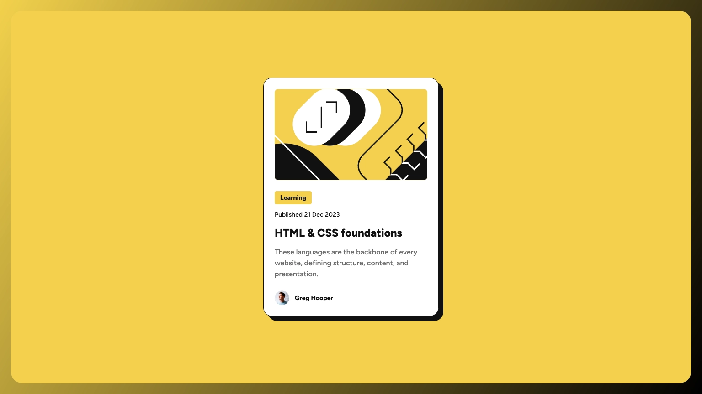

# Frontend Mentor - Blog preview card solution

This is a solution to the [Blog preview card challenge on Frontend Mentor](https://www.frontendmentor.io/challenges/blog-preview-card-ckPaj01IcS). Frontend Mentor challenges help you improve your coding skills by building realistic projects.

## Table of contents

- [Overview](#overview)
  - [The challenge](#the-challenge)
  - [Screenshot](#screenshot)
  - [Links](#links)
- [My process](#my-process)
  - [Built with](#built-with)
- [Author](#author)

## Overview

### The challenge

Users should be able to:

- [x] See hover and focus states for all interactive elements on the page

### Screenshot

### Links

- Solution URL: [Frontend Mentor](https://www.frontendmentor.io/solutions/blog-preview-card-css-grid-flexbox-oZ6sstP3xj)
- Live Site URL: [GitHub Pages](https://raubaca.github.io/frontendmentor/blog-preview-card/)

## My process

### Built with

- Semantic HTML5 markup
- CSS custom properties
- Flexbox
- CSS Grid
- Mobile-first workflow
- [BEM](https://en.bem.info/methodology/css/) - CSS Methodology

## Author

- LinkedIn - [Raúl Barrera](https://www.linkedin.com/in/raubaca/)
- CodePen - [@raubaca](https://codepen.io/raubaca)
- Frontend Mentor - [@raubaca](https://www.frontendmentor.io/profile/raubaca)
