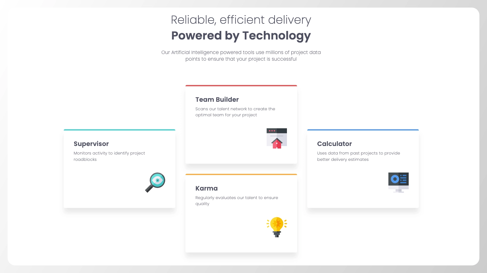

# Frontend Mentor - Four card feature section solution

This is a solution to the [Four card feature section challenge on Frontend Mentor](https://www.frontendmentor.io/challenges/four-card-feature-section-weK1eFYK). Frontend Mentor challenges help you improve your coding skills by building realistic projects.

## Table of contents

- [Overview](#overview)
  - [The challenge](#the-challenge)
  - [Screenshot](#screenshot)
  - [Links](#links)
- [My process](#my-process)
  - [Built with](#built-with)
  - [What I learned](#what-i-learned)
  - [Useful resources](#useful-resources)
- [Author](#author)

## Overview

### The challenge

Users should be able to:

- [x] View the optimal layout for the site depending on their device's screen size

### Screenshot



### Links

- Live Site URL: [GitHub Pages](https://raubaca.github.io/frontendmentor/four-card-feature-section/)

## My process

### Built with

- Semantic HTML5 markup
- CSS custom properties
- Flexbox
- CSS Grid
- Mobile-first workflow

### What I learned

In this project, I had the opportunity to learn more about CSS columns and a way to generate columns for multiple screen sizes in one line of code, using `auto-fit`.

Instead of define the number of grid columns:

```css
.grid {
  display: grid;
  grid-template-columns: repeat(12, 1fr);
}
```

We specify the minimum width for the columns and let the browser handle the number or columns for us:

```css
.grid {
  display: grid;
  grid-template-columns: repeat(auto-fit, minmax(250px, 1fr));
}
```

### Useful resources

- [Auto-Sizing Columns in CSS Grid: `auto-fill` vs `auto-fit`](https://css-tricks.com/auto-sizing-columns-css-grid-auto-fill-vs-auto-fit/) - Article about CSS Grid columns sizing, helpful for responsive designs.

## Author

- LinkedIn - [Raúl Barrera](https://www.linkedin.com/in/raubaca/)
- CodePen - [@raubaca](https://codepen.io/raubaca)
- Frontend Mentor - [@raubaca](https://www.frontendmentor.io/profile/raubaca)
