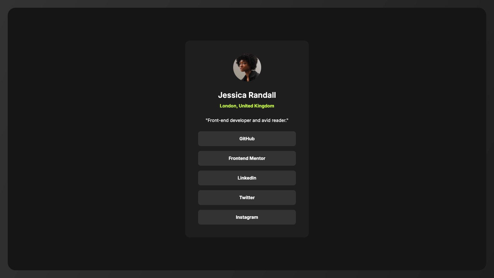

# Frontend Mentor - Social links profile solution

This is a solution to the [Social links profile challenge on Frontend Mentor](https://www.frontendmentor.io/challenges/social-links-profile-UG32l9m6dQ). Frontend Mentor challenges help you improve your coding skills by building realistic projects.

## Table of contents

- [Overview](#overview)
  - [The challenge](#the-challenge)
  - [Screenshot](#screenshot)
  - [Links](#links)
- [My process](#my-process)
  - [Built with](#built-with)
  - [What I learned](#what-i-learned)
  - [Useful resources](#useful-resources)
- [Author](#author)
- [Acknowledgments](#acknowledgments)

## Overview

### The challenge

Users should be able to:

- [x] See hover and focus states for all interactive elements on the page

### Screenshot



### Links

- Solution URL: [Frontend Mentor](https://www.frontendmentor.io/solutions/social-links-profile-css-grid-css-variables-XGEt2_hBTy)
- Live Site URL: [GitHub Pages](https://raubaca.github.io/frontendmentor/social-links-profile/)

## My process

### Built with

- Semantic HTML5 markup
- CSS custom properties
- Flexbox
- CSS Grid
- Mobile-first workflow

### What I learned

Based on some CSS issues reported in a previous project, I learned about `prefers-reduced-motion` feature, used to detect user device settings about of motion/amimations.

```
@media (prefers-reduced-motion: reduce) {
  .animation {
    ...
  }
}
```

### Useful resources

- [prefers-reduced-motion](https://developer.mozilla.org/en-US/docs/Web/CSS/Reference/At-rules/@media/prefers-reduced-motion) - MDN resource about this CSS media feature.

## Author

- LinkedIn - [Raúl Barrera](https://www.linkedin.com/in/raubaca/)
- CodePen - [@raubaca](https://codepen.io/raubaca)
- Frontend Mentor - [@raubaca](https://www.frontendmentor.io/profile/raubaca)
