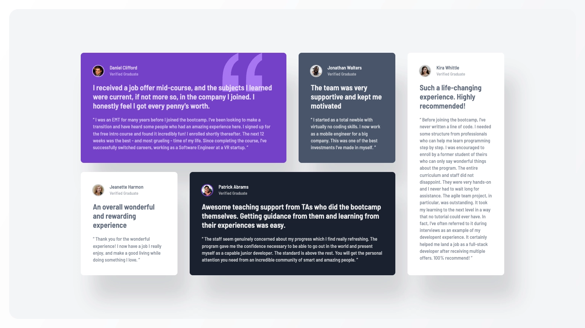

# Frontend Mentor - Testimonials grid section solution

This is a solution to the [Testimonials grid section challenge on Frontend Mentor](https://www.frontendmentor.io/challenges/testimonials-grid-section-Nnw6J7Un7). Frontend Mentor challenges help you improve your coding skills by building realistic projects.

## Table of contents

- [Overview](#overview)
  - [The challenge](#the-challenge)
  - [Screenshot](#screenshot)
  - [Links](#links)
- [My process](#my-process)
  - [Built with](#built-with)
  - [Useful resources](#useful-resources)
- [Author](#author)

## Overview

### The challenge

Users should be able to:

- [x] View the optimal layout for the site depending on their device's screen size

### Screenshot

### Links

- Solution URL:
- Live Site URL: [GitHub Pages](https://raubaca.github.io/frontendmentor/testimonials-grid-section/)

## My process

### Built with

- Semantic HTML5 markup
- Mobile-first workflow
- [Tailwind CSS](https://tailwindcss.com/)

### Useful resources

- [Get started with Tailwind CSS](https://tailwindcss.com/docs/installation/using-vite) - Tailwind CSS Documentation

## Author

- LinkedIn - [Raúl Barrera](https://www.linkedin.com/in/raubaca/)
- CodePen - [@raubaca](https://codepen.io/raubaca)
- Frontend Mentor - [@raubaca](https://www.frontendmentor.io/profile/raubaca)
